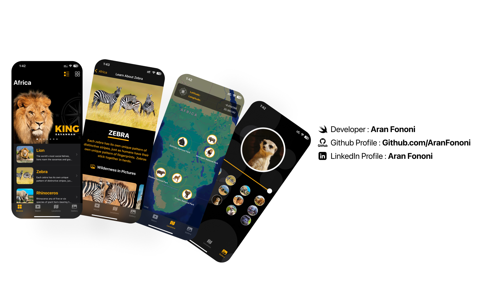

# SwiftUI Multi-Feature App 📱🧩  

### Exploring SwiftUI with Real-World Features  

This project is built during Chapter 13 of the SwiftUI Masterclass. It brings together several key iOS development skills into one app — from working with JSON to building grid layouts, using MapKit, video playback, and even launching the app on macOS with Catalyst.  

## 📌 Project Overview  
The app is made to show how different Swift and SwiftUI features can come together in a clean, working project. It covers topics like building layouts, working with APIs, integrating maps, adding stickers, and using extensions and generics.  

## 🚀 What’s Inside  
- **SwiftUI Grids:** Simple and advanced grid views  
- **JSON Parsing:** Basic and advanced ways to handle data  
- **MapKit:** Show location with a clean map view  
- **Video Player:** Built-in player for local or remote videos  
- **App Launch Screen:** Custom launch screen  
- **Swift Concepts:** Extensions and Generics in action  
- **Stickers:** iMessage Sticker Pack integration  
- **Mac Catalyst:** Run the same app on macOS with iPad layout  
- **Bundle & Extensions:** Learn how to access assets and code separation  

## 🔥 Highlights  
✅ 1 list and 3 dynamic grid views  
✅ Tab menu layout to switch between features  
✅ Sidebar navigation on iPad and macOS  
✅ Real video playback  
✅ Sticker pack as iMessage extension  

---

## 📸 Screenshots  
 

---

## 🛠️ How to Run  
1. Clone this repo.  
2. Open the `.xcodeproj` or `.xcworkspace` file in Xcode.  
3. Run it on a simulator or device with iOS 14+ (or macOS with Catalyst).  

---

## 📬 Contact  
For any questions or feedback, feel free to reach out:  
- **Email**: [aranfononi@gmail.com](mailto:aranfononi@gmail.com)  
- **LinkedIn**: [Aran Fononi](https://www.linkedin.com/in/aran-fononi-18182b265)  
